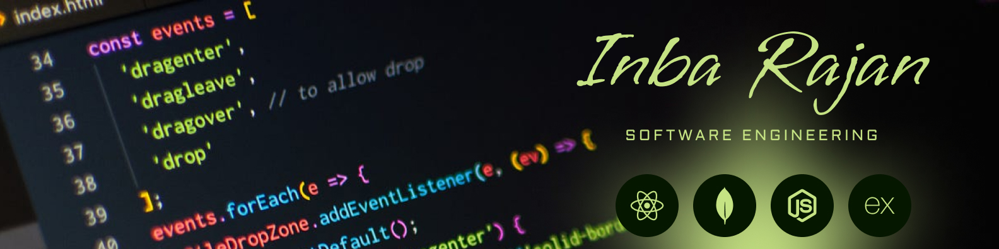

<h1> Hey! Nice to see you.</h1>

Welcome to my page!   

I'm Inba Rajan
Full Stack Developer with `2.6 years` of experience specializing in **MERN stack development**. Skilled in building scalable web applications using **React**, **Node.js**, **Express**, **MongoDB**, and **TypeScript**. Experienced in working on frontend architecture, and UI component design using modern frameworks like **Next.js** and **shadcn-ui**. Passionate about delivering clean, performant code with a strong focus on user experience and responsive design.</b>

Can't able to view? kindly do hard refresh once.  
📄 [Résumé](https://its-inbarajan.github.io/resume/)

<h1>Own Project</h1>

Employee Portal : https://employee-portal-eta.vercel.app/

<h3>Things I code with</h3>

  
  
  
   
  
  
  
  
  
  
  
  
  
  
  
  
  
  
  
  
  
  
  
  
  
  
  
  
  
  

<h3>Where to find me</h3>

   
   
   
  <!-- ->
  

